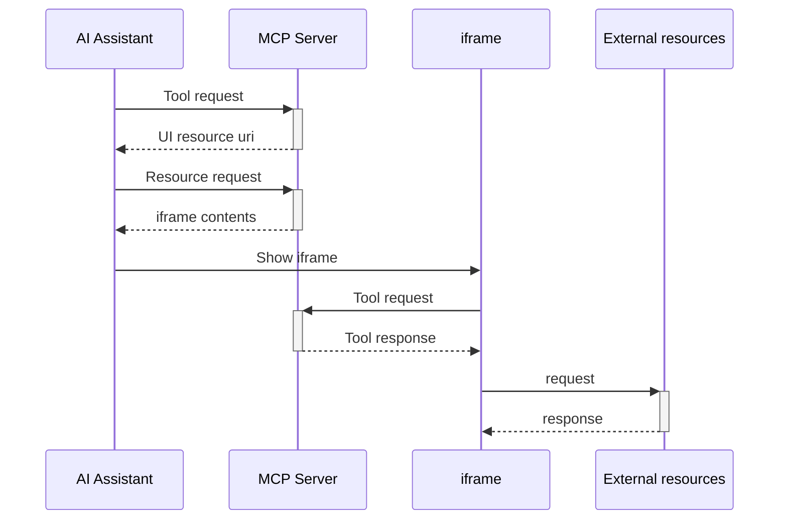

# Cesium MCP App Servers

pnpm monorepo containing Cesium MCP Apps for AI assistants.

## 📦 Packages

| Package                                           | Description                  | Port |
| ------------------------------------------------- | ---------------------------- | ---- |
| [`@cesium-mcp-apps/codegen`](./codegen/README.md) | Cesium views code generation | 3001 |

## 🛠️ MCP Servers

### 🎥 [cesium-codegen](./codegen/README.md)

MCP App for generating Cesium views.

| Tool      | Description                              |
| --------- | ---------------------------------------- |
| `codegen` | Generate Views from provided description |

## 🏗️ Structure

```
mcp-apps/
├── codegen/                 # @cesium-mcp/codegen
├── package.json             # pnpm workspace root
└── pnpm-workspace.yaml
```

## 🚀 Quick Start

### Prerequisites

- [Node.js](https://nodejs.org/) >= 18
- [pnpm](https://pnpm.io/) >= 8

### Install & Build

```bash
# From this directory
pnpm install

# Build all packages in dependency order
pnpm run build
```

## 💻 Build Commands

```bash
pnpm run build              # Build everything
pnpm run build:codegen      # @cesium-mcp-apps/codegen only
pnpm run clean              # Remove all build artifacts
```

## ▶️ Running

### MCP Servers

```bash
pnpm run start:codegen     # Codegen server on port 3001
```

### Using with AI Clients

The codegen server works with MCP clients that support MCP Apps like **Claude Desktop**.

MCP App can be tested using [Basic Host](https://github.com/modelcontextprotocol/ext-apps/tree/main/examples/basic-host). Set `HOST_URL` value in `SERVERS` environment variable to connect Basic Host to MCP Server.

## 🏛️ Architecture



1. **AI assistant** calls MCP tool.
2. **MCP tool** returns associated UI component resource in `_meta.ui.resourceUri`.
3. **AI assistant** downloads associated resource.
4. **AI assistant** shows resource contents as a webpage in **iframe**.
5. **iframe** script calls MCP tool.
6. MCP tool returns result to **iframe**
7. **iframe** renders, external requests can optionally be made.

## 🤝 Contributing

See the root [CONTRIBUTING.md](../../CONTRIBUTING.md) for guidelines.

## 📄 License

Apache-2.0 — see [LICENSE](../../LICENSE).
